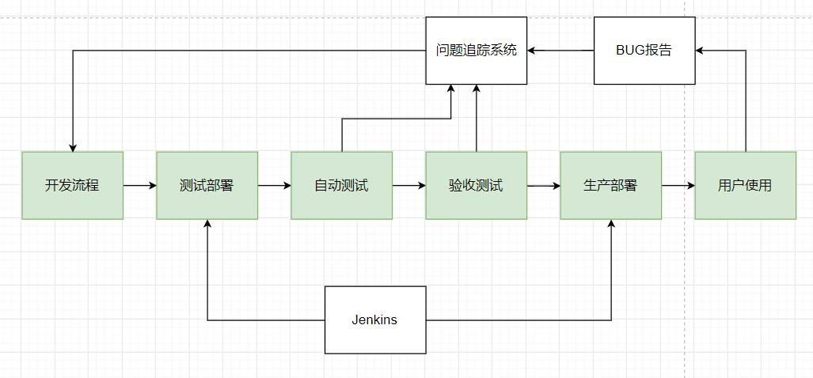

# CI 相关内容

# 基本

	其实和普通的开发部署也没本质区别。

# 实操

	一个DEMO, 带自动测试
	一个Jenkins，
	一个部署机器(假定为Docker)，
	一个问题管理系统（JIRA）
	麻烦死了，懒得弄了

# 发布版本的问题

	由于问题的反馈是基于某一个版本的，因此最好由发布系统自动标记。
	具体命名可以包含，自定的版本/git提交号/时间 等

# 测试

	自动测试理想下会在部署后自动执行，报告。 
	但这个涉及到测试数据的问题，比如重置测试数据库。 
	但经常这个是不可行的，比如你的组件依赖了第三方的数据，那么你很难要求他们重置数据之类的。

## 集成测试 

	测试中比较麻烦的一个，就是系统总体是由多个组件构成，也就是测试/数据/反馈都涉及多个开发组。
	事实上，各个组件都应该有自己的一定边界，也就是独立的可测试性。
	但也会有需要通过多组件才能完成（被测试）的功能。